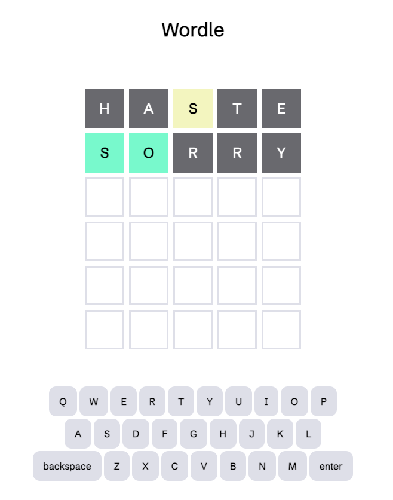

# Wordle: Easter edition

# Background

Wordle Easter edition is a re-creation of the popular web-based game Wordle in the theme of Easter, which was upcoming at the time of its initial release.  The original Wordle game was developed by Welsh software engineer Josh Wardle and was subsequently purchased by the New York Times.  

Whereas the original Wordle has only one correct solution each day, Wordle: Easter Edition allows players to replay the game multiple times in a day.

# Gameplay

The goal of the game is to guess the correct 5-letter word by submitting a guess then receiving hints that indicate whether any of the letters in the guessed word match those in the correct word.  
* Players have 6 attempts to guess the correct word. 
* Tiles turn green if the guessed letter matches the letter in the same place within the correct word.  
* Tiles turn yellow if the guessed letter in the tile is contained in the correct word but located in a different place within the word.  
* Black tiles indicate the letter is not present within the correct word whatsoever. 

# [Play the game here](https://easter-wordle.netlify.app/)

# Technologies used
* CSS
* JavaScript
* HTML
* Git

# Attributions
My sincere thanks to the creators who made their content available to be freely used by developers.

Wordle: Easter Edition makes use of the font Schibsted Grotesk designed by Bakken & Bæck, Henrik Kongsvoll and is made available through Google fonts.  It can be accessed at [google fonts](https://fonts.google.com/specimen/Schibsted+Grotesk?query=schibsted+grotesk).

Wordle: Easter Edition uses a favicon made available by Freepik in their [easeter icons](https://www.flaticon.com/free-icons/easter) collection and can be found [here](https://www.flaticon.com/free-icon/easter_9870812?term=easter&page=1&position=49&origin=tag&related_id=9870812).

# Ice Box
- Optimize the on-screen keyboard for mobile devices
- Validate user guesses are actual words
- Eliminate repetition of the same correct word
- Animate tiles as the correct/incorrect letters are revealed
- Animate a wiggle of the row when a user selects invalid input
- Add themes for other holidays
- Dark mode